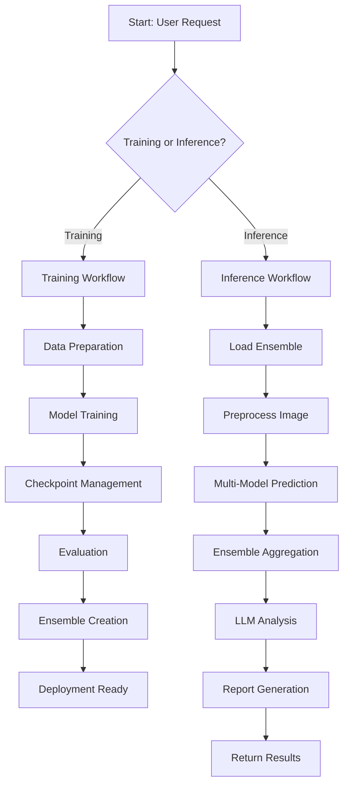

# 🔄 LangGraph Workflow - Model Training Pipeline

## 📋 Overview

This document explains the **complete workflow** for the Fracture Detection AI system, showing how each component connects and manages the training, deployment, and inference process.

---

## 🎯 Complete Workflow Architecture



---

## 🔄 Training Workflow (LangGraph State Machine)

### **State Definition:**

```python
from typing import TypedDict, List, Dict, Any
from langgraph.graph import StateGraph, END

class TrainingState(TypedDict):
    """State for training workflow"""
    # Configuration
    model_name: str
    epochs: int
    batch_size: int
    
    # Progress tracking
    current_phase: str  # 'phase1' or 'phase2'
    current_epoch: int
    total_epochs: int
    
    # Model state
    model: Any
    base_model: Any
    
    # Data
    train_data: Any
    val_data: Any
    test_data: Any
    
    # Metrics
    training_history: Dict
    best_accuracy: float
    best_epoch: int
    
    # Checkpoints
    checkpoint_dir: str
    latest_checkpoint: str
    
    # Logging
    log_file: str
    metrics_csv: str
    
    # Status
    status: str  # 'running', 'paused', 'completed', 'failed'
    error: str
```

---

## 📊 Training Workflow Nodes

### **Node 1: Initialize Training**

```python
def initialize_training(state: TrainingState) -> TrainingState:
    """
    Initialize training session
    
    Actions:
    - Setup logging
    - Create checkpoint directories
    - Load configuration
    - Initialize metrics tracking
    """
    logger, log_file = setup_logging(state['model_name'])
    
    state['log_file'] = log_file
    state['checkpoint_dir'] = f"checkpoints/fracatlas/{state['model_name']}/"
    state['status'] = 'initialized'
    state['current_epoch'] = 0
    state['best_accuracy'] = 0.0
    
    logger.info(f"Training initialized for {state['model_name']}")
    
    return state
```

### **Node 2: Load Data**

```python
def load_data(state: TrainingState) -> TrainingState:
    """
    Load and prepare dataset
    
    Actions:
    - Load FracAtlas dataset
    - Split into train/val/test
    - Apply data augmentation
    - Calculate class weights
    """
    logger = logging.getLogger(__name__)
    logger.info("Loading FracAtlas dataset...")
    
    train_data, val_data, test_data = load_fracatlas_data(
        input_size=224,
        batch_size=state['batch_size']
    )
    
    state['train_data'] = train_data
    state['val_data'] = val_data
    state['test_data'] = test_data
    state['status'] = 'data_loaded'
    
    logger.info("Dataset loaded successfully")
    
    return state
```

### **Node 3: Create Model**

```python
def create_model_node(state: TrainingState) -> TrainingState:
    """
    Create and compile model
    
    Actions:
    - Load pre-trained base model
    - Add custom head
    - Compile with loss and metrics
    - Setup callbacks
    """
    logger = logging.getLogger(__name__)
    logger.info(f"Creating {state['model_name']} model...")
    
    model, base_model, input_size = create_model(state['model_name'])
    
    state['model'] = model
    state['base_model'] = base_model
    state['status'] = 'model_created'
    
    logger.info(f"Model created: {model.count_params():,} parameters")
    
    return state
```

### **Node 4: Train Phase 1**

```python
def train_phase1(state: TrainingState) -> TrainingState:
    """
    Train with frozen base (Phase 1)
    
    Actions:
    - Freeze base model
    - Train custom head
    - Save checkpoints every 5 epochs
    - Monitor validation metrics
    - Update state with history
    """
    logger = logging.getLogger(__name__)
    logger.info("Starting Phase 1: Frozen base training")
    
    state['current_phase'] = 'phase1'
    
    # Create checkpoint callbacks
    callbacks = create_checkpoint_callbacks(
        state['model_name'], 
        phase='phase1'
    )
    
    # Train
    history = state['model'].fit(
        state['train_data'],
        validation_data=state['val_data'],
        epochs=state['epochs'] // 2,
        callbacks=callbacks,
        verbose=1
    )
    
    state['training_history'] = history.history
    state['current_epoch'] = state['epochs'] // 2
    state['status'] = 'phase1_complete'
    
    logger.info("Phase 1 complete")
    
    return state
```

### **Node 5: Train Phase 2**

```python
def train_phase2(state: TrainingState) -> TrainingState:
    """
    Fine-tune top layers (Phase 2)
    
    Actions:
    - Unfreeze top layers
    - Lower learning rate
    - Continue training
    - Save final model
    """
    logger = logging.getLogger(__name__)
    logger.info("Starting Phase 2: Fine-tuning")
    
    state['current_phase'] = 'phase2'
    
    # Unfreeze top layers
    state['base_model'].trainable = True
    for layer in state['base_model'].layers[:-50]:
        layer.trainable = False
    
    # Recompile with lower LR
    state['model'].compile(
        optimizer=tf.keras.optimizers.Adam(0.0001),
        loss=get_focal_loss(),
        metrics=['accuracy', 'AUC', 'Precision', 'Recall']
    )
    
    # Create callbacks
    callbacks = create_checkpoint_callbacks(
        state['model_name'],
        phase='phase2'
    )
    
    # Train
    history = state['model'].fit(
        state['train_data'],
        validation_data=state['val_data'],
        epochs=state['epochs'] // 2,
        initial_epoch=state['current_epoch'],
        callbacks=callbacks,
        verbose=1
    )
    
    state['current_epoch'] = state['epochs']
    state['status'] = 'phase2_complete'
    
    logger.info("Phase 2 complete")
    
    return state
```

### **Node 6: Evaluate Model**

```python
def evaluate_model(state: TrainingState) -> TrainingState:
    """
    Evaluate on test set
    
    Actions:
    - Run predictions on test data
    - Calculate all metrics
    - Generate confusion matrix
    - Save results to JSON
    """
    logger = logging.getLogger(__name__)
    logger.info("Evaluating model on test set...")
    
    results = state['model'].evaluate(state['test_data'], verbose=1)
    
    metrics = {
        'model': state['model_name'],
        'loss': float(results[0]),
        'accuracy': float(results[1]),
        'auc': float(results[2]),
        'precision': float(results[3]),
        'recall': float(results[4]),
        'epochs_trained': state['current_epoch']
    }
    
    # Calculate F1
    if metrics['precision'] + metrics['recall'] > 0:
        metrics['f1_score'] = 2 * (metrics['precision'] * metrics['recall']) / \
                              (metrics['precision'] + metrics['recall'])
    
    state['final_metrics'] = metrics
    state['status'] = 'evaluated'
    
    logger.info(f"Evaluation complete: Accuracy={metrics['accuracy']:.4f}")
    
    return state
```

### **Node 7: Save Model**

```python
def save_model_node(state: TrainingState) -> TrainingState:
    """
    Save final model and results
    
    Actions:
    - Save model to .h5 file
    - Save metrics to JSON
    - Save training history
    - Update model registry
    """
    logger = logging.getLogger(__name__)
    
    # Save model
    model_path = f"models/fracatlas/{state['model_name']}_final.h5"
    state['model'].save(model_path)
    
    # Save metrics
    results_path = f"results/fracatlas/{state['model_name']}_results.json"
    with open(results_path, 'w') as f:
        json.dump(state['final_metrics'], f, indent=2)
    
    state['status'] = 'completed'
    
    logger.info(f"Model saved: {model_path}")
    logger.info(f"Results saved: {results_path}")
    
    return state
```

---

## 🔄 Workflow Graph Construction

```python
from langgraph.graph import StateGraph, END

def create_training_workflow():
    """Create LangGraph workflow for training"""
    
    # Create graph
    workflow = StateGraph(TrainingState)
    
    # Add nodes
    workflow.add_node("initialize", initialize_training)
    workflow.add_node("load_data", load_data)
    workflow.add_node("create_model", create_model_node)
    workflow.add_node("train_phase1", train_phase1)
    workflow.add_node("train_phase2", train_phase2)
    workflow.add_node("evaluate", evaluate_model)
    workflow.add_node("save", save_model_node)
    
    # Add edges (workflow flow)
    workflow.set_entry_point("initialize")
    workflow.add_edge("initialize", "load_data")
    workflow.add_edge("load_data", "create_model")
    workflow.add_edge("create_model", "train_phase1")
    workflow.add_edge("train_phase1", "train_phase2")
    workflow.add_edge("train_phase2", "evaluate")
    workflow.add_edge("evaluate", "save")
    workflow.add_edge("save", END)
    
    return workflow.compile()
```

---

## 🚀 Running the Workflow

```python
# Initialize state
initial_state = TrainingState(
    model_name="efficientnet_b0",
    epochs=50,
    batch_size=32,
    current_phase="",
    current_epoch=0,
    total_epochs=50,
    status="pending"
)

# Create and run workflow
training_workflow = create_training_workflow()
final_state = training_workflow.invoke(initial_state)

# Check results
print(f"Training Status: {final_state['status']}")
print(f"Final Accuracy: {final_state['final_metrics']['accuracy']:.4f}")
```

---

## 🔄 Inference Workflow (LangGraph)

### **Inference State:**

```python
class InferenceState(TypedDict):
    """State for inference workflow"""
    # Input
    image_path: str
    image_data: Any
    
    # Models
    ensemble_models: List[Any]
    model_weights: Dict[str, float]
    
    # Predictions
    individual_predictions: List[Dict]
    ensemble_prediction: Dict
    
    # LLM Analysis
    llm_analysis: str
    medical_report: str
    recommendations: str
    
    # Output
    final_result: Dict
    status: str
```

### **Inference Nodes:**

```python
def load_ensemble(state: InferenceState) -> InferenceState:
    """Load all trained models"""
    models = []
    weights = {}
    
    for model_name in ['resnet50', 'efficientnet_b0', 'efficientnet_b1']:
        model = tf.keras.models.load_model(f'models/fracatlas/{model_name}_final.h5')
        models.append(model)
        
        # Load weights from results
        with open(f'results/fracatlas/{model_name}_results.json') as f:
            results = json.load(f)
            weights[model_name] = results['auc']
    
    state['ensemble_models'] = models
    state['model_weights'] = weights
    
    return state

def preprocess_image(state: InferenceState) -> InferenceState:
    """Preprocess input image"""
    image = tf.keras.preprocessing.image.load_img(
        state['image_path'],
        target_size=(224, 224)
    )
    image_array = tf.keras.preprocessing.image.img_to_array(image)
    image_array = np.expand_dims(image_array, axis=0)
    image_array = image_array / 255.0
    
    state['image_data'] = image_array
    
    return state

def predict_ensemble(state: InferenceState) -> InferenceState:
    """Get predictions from all models"""
    predictions = []
    
    for i, model in enumerate(state['ensemble_models']):
        pred = model.predict(state['image_data'])[0][0]
        predictions.append({
            'model': ['resnet50', 'efficientnet_b0', 'efficientnet_b1'][i],
            'confidence': float(pred),
            'weight': state['model_weights'][['resnet50', 'efficientnet_b0', 'efficientnet_b1'][i]]
        })
    
    state['individual_predictions'] = predictions
    
    # Weighted average
    weighted_sum = sum(p['confidence'] * p['weight'] for p in predictions)
    total_weight = sum(p['weight'] for p in predictions)
    final_confidence = weighted_sum / total_weight
    
    state['ensemble_prediction'] = {
        'confidence': final_confidence,
        'result': 'Fractured' if final_confidence > 0.5 else 'Non-Fractured'
    }
    
    return state

def generate_llm_analysis(state: InferenceState) -> InferenceState:
    """Generate detailed analysis using LLM"""
    from src.llm_integration.gemini_client import GeminiClient
    
    client = GeminiClient()
    
    # Load prompt
    with open('prompts_library/gemini_prompts/fracture_analysis.txt') as f:
        prompt = f.read()
    
    # Generate analysis
    analysis = client.generate_analysis(
        image_path=state['image_path'],
        prediction=state['ensemble_prediction'],
        prompt=prompt
    )
    
    state['llm_analysis'] = analysis
    
    return state

def generate_report(state: InferenceState) -> InferenceState:
    """Generate medical report"""
    from src.llm_integration.gemini_client import GeminiClient
    
    client = GeminiClient()
    
    # Load prompt
    with open('prompts_library/gemini_prompts/report_generation.txt') as f:
        prompt = f.read()
    
    # Generate report
    report = client.generate_report(
        analysis=state['llm_analysis'],
        prediction=state['ensemble_prediction'],
        prompt=prompt
    )
    
    state['medical_report'] = report
    
    return state
```

---

## 📊 Complete System Flow

```
1. User uploads X-ray image
   ↓
2. Image preprocessed (224x224, normalized)
   ↓
3. Ensemble prediction (3 models)
   ├─ ResNet50 → 92% confidence
   ├─ EfficientNetB0 → 88% confidence
   └─ EfficientNetB1 → 95% confidence
   ↓
4. Weighted aggregation → 93% final confidence
   ↓
5. LLM analysis (Gemini)
   ├─ Visual assessment
   ├─ Classification
   └─ Severity grading
   ↓
6. Report generation (Gemini)
   ├─ 12-section medical report
   ├─ Recommendations
   └─ Disclaimers
   ↓
7. Return to user
   ├─ Final result
   ├─ Individual predictions
   ├─ Medical report
   └─ Recommendations
```

---

## 🎯 Key Benefits of LangGraph Workflow

### **1. State Management** ✅
- Track training progress
- Resume from checkpoints
- Handle interruptions gracefully

### **2. Error Handling** ✅
- Retry failed nodes
- Fallback strategies
- Detailed error logging

### **3. Modularity** ✅
- Each node is independent
- Easy to test
- Easy to modify

### **4. Observability** ✅
- Track state at each step
- Log all transitions
- Monitor progress

### **5. Scalability** ✅
- Add new models easily
- Parallel training possible
- Distributed execution

---

## 🚀 Summary

**Training Workflow:**
```
Initialize → Load Data → Create Model → Phase 1 → Phase 2 → Evaluate → Save
```

**Inference Workflow:**
```
Load Ensemble → Preprocess → Predict → LLM Analysis → Report → Return
```

**All managed by LangGraph state machine with:**
- Checkpoint recovery
- Progress tracking
- Error handling
- Logging
- Metrics collection

**Ready for production deployment!** 🎉
